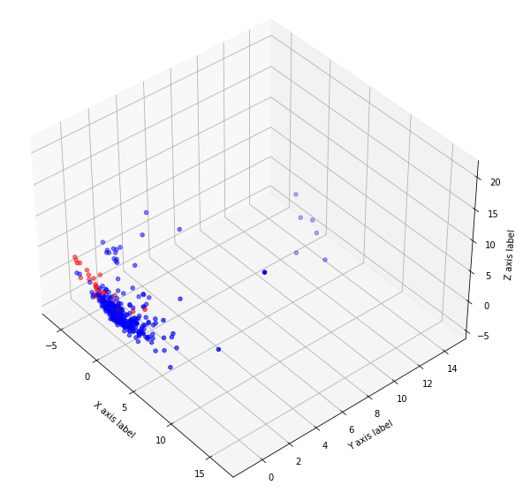

## 04 Visualization

In this section, we mainly want to visualize the data, see the distribution of the data and prepare for further analysis. To visualize, we need to reduce the dimensionality of the input data to 3 dimensions to view the data in 3D space. Here, we have used PCA to reduce dimensionality.

- `data.csv`: Generated data files that have been desensitized.
- `visualize.ipynb`: Train the classifier using MinMaxScaler.

### Results

Red is the positive class.

Whole dataset (without scaling):

Whole dataset (with scaling):

Train dataset (with scaling):

---

[Next section](../05_remove_outliers)

[Back to Task 1](../../task_1)
