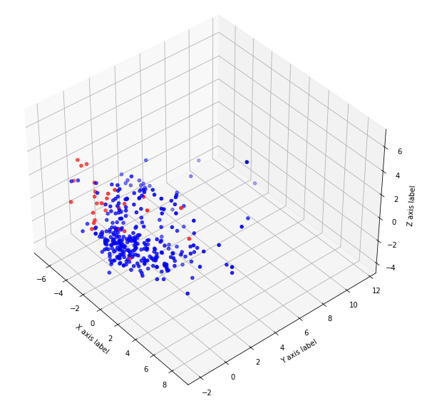
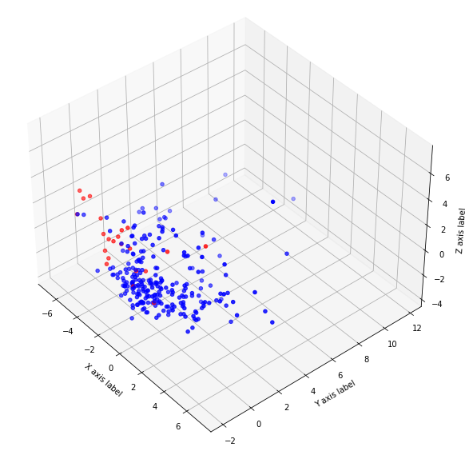

## 05 Remove Outliers

In the previous section, we found some very obvious outliers. They may affect not only the scaling but also the model's performance, so we remove the more obvious outliers from the dataset in this section.

- `data.csv`: Generated data files that have been desensitized.
- `visualize.ipynb`: Train the classifier using MinMaxScaler.

### Results

Red is the positive class.

After removing the outlier points, we again look at the graph.

Whole dataset:

Train dataset:

Training the model again yields the following results:

- Accuracy: `94.03%`
- Recall rate: `31.25%`

The performance is not improved by just outliers removal.

---

[Next section](../06_balance_data)

[Back to Task 1](../../task_1)
