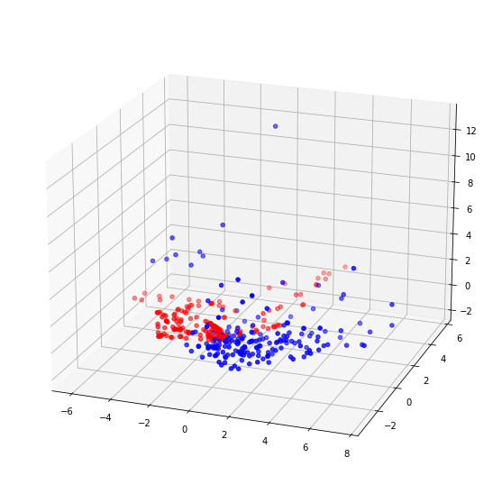
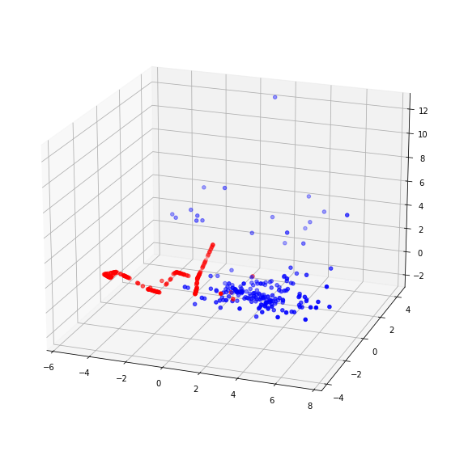
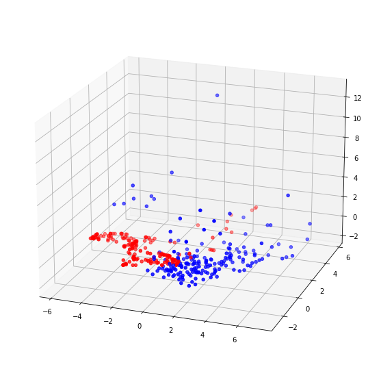
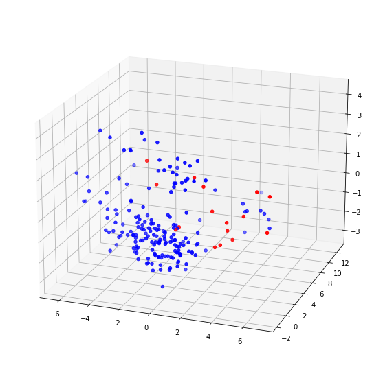

## 06 Balance Data

In the previous section, 
we can observe a significant imbalance in the data. 
Positive class samples have fewer data.

Considering the total samples size is also smaller, 
we take the oversampling minority approach to balance the data.

Here, we have tried several common oversampling methods.

- `data.csv`: Generated data files that have been desensitized.
- `ADASYN.ipynb`: Using ADASYN to oversample.
- `KMeansSMOTE.ipynb`: Using KMeansSMOTE to oversample.
- `SMOTE.ipynb`: Using SMOTE to oversample.
- `Weight.ipynb`: Instead of using oversampling techniques, the model is tuned by adjusting the class weight.

### Results

Red is the positive class.

We excluded the KMeansSMOTE method from subsequent use based on the following results.

#### ADASYN

Train dataset:

- Accuracy: `91.81%`
- Recall rate: `59.12%`

#### KMeansSMOTE

Train dataset:

- Accuracy: `93.19%`
- Recall rate: `50.21%`

#### SMOTE

Train dataset:

- Accuracy: `91.81%`
- Recall rate: `59.21%`

#### Weight

Train dataset:

- Accuracy: `92.44%`
- Recall rate: `60.00%`

---

[Next section](../07_scaling_selection)

[Back to Task 1](../../task_1)
