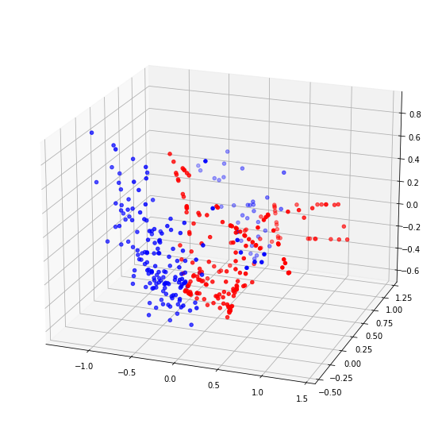
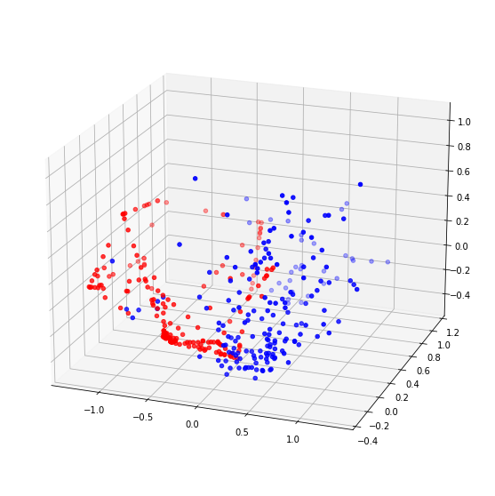
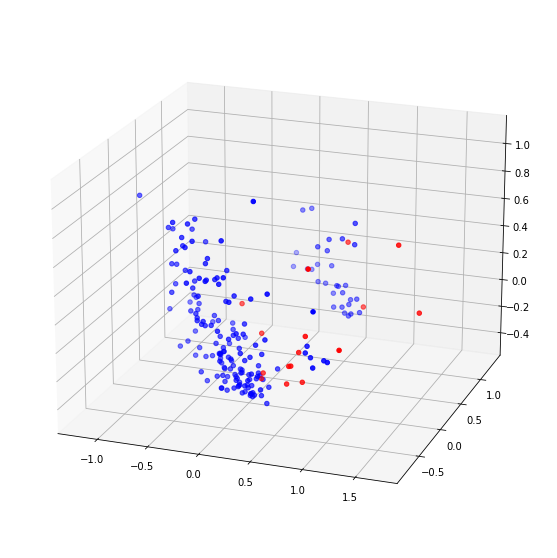

## 07 Scaling Selection 

This section tests other feature scaling methods to choose the optimal solution.

Previously, we have been using StandardScaler. Now, other feature scaling methods used are: MinMaxScaler, Normalizer.

- `data.csv`: Generated data files that have been desensitized.
- `ADASYN_MinMax.ipynb`: Train the classifier using ADASYN + MinMaxScaler.
- `ADASYN_Normalization.ipynb`: Train the classifier using ADASYN + Normalizer.
- `SMOTE_MinMax.ipynb`: Train the classifier using SMOTE + MinMaxScaler.
- `SMOTE_Normalization.ipynb`: Train the classifier using SMOTE + Normalizer.
- `Weight_MinMax.ipynb`: Train the classifier using Weight + MinMaxScaler.
- `Weight_Normalization.ipynb`: Train the classifier using Weight + Normalizer.

### Results

Based on the results, we decided not to adopt ADASYN oversampling approach. And instead of continuing with the previous StandardScaler, we used the MinMaxScaler.

#### ADASYN

##### MinMaxScaler

Train Set:

- Accuracy: `90.00%`
- Recall: `65.08%`
- ROC-AUC: `0.89`

##### Normalizer

- Accuracy: `62.50%`
- Recall: `46.25%`
- ROC-AUC: `0.59`

#### SMOTE

##### MinMaxScaler

Train Set:

- Accuracy: `90.18%`
- Recall: `66.29%`
- ROC-AUC: `0.91`

##### Normalizer

- Accuracy: `72.25%`
- Recall: `37.38%`
- ROC-AUC: `0.61`

#### Weight 

##### MinMaxScaler

Train Set:

- Accuracy: `91.09%`
- Recall: `65.58%`
- ROC-AUC: `0.89`

##### Normalizer

- Accuracy: `89.25%`
- Recall: `21.92%`
- ROC-AUC: `0.69`

---

[Next section](../08_dimensionality)

[Back to Task 1](../../task_1)
