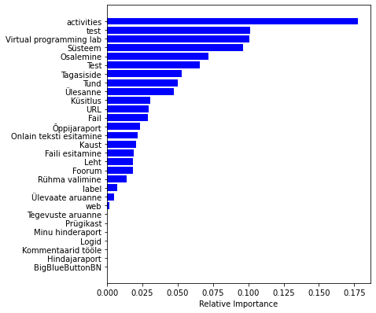

## 08 Dimensionality

Previously, we selected the main features by RandomForest. 
This section will continue to explore other ways to reduce dimensionality and compare the advantages and disadvantages.

- `data.csv`: Generated data files that have been desensitized.
- `ratio.ipynb`: Check the ratio of the two data types and set the `class_weight` parameter of the random forest model based on this value.
- `SMOTE_Importances.ipynb`: SMOTE + selecting features for training by the feature importance given by the random forest.
- `SMOTE_PCA.ipynb`: SMOTE + PCA.
- `Weight_Importances.ipynb`: Class weight + selecting features for training by the feature importance given by the random forest.
- `Weight_PCA.ipynb`: Class weight + PCA.

### Results

By comparing the results, 
we abandoned the PCA approach and used RandomForest to help select the main features.

#### SMOTE + RandomForest

- Accuracy: `88.98%`
- Recall: `70.96%`
- ROC-AUC: `0.93`

#### SMOTE + PCA 

- Accuracy: `80.29%`
- Recall: `67.58%`
- ROC-AUC: `0.84`

#### Weight + RandomForest

- Accuracy: `90.59%`
- Recall: `67.75%`
- ROC-AUC: `0.91`

#### Weight + PCA

- Accuracy: `91.57%`
- Recall: `57.00%`
- ROC-AUC: `0.85`

---

[Next section](../09_params_tuning)

[Back to Task 1](../../task_1)
