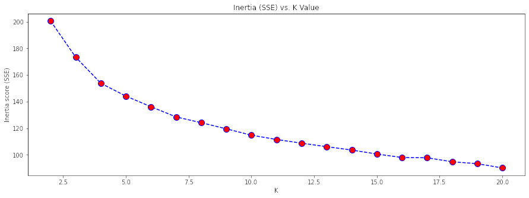
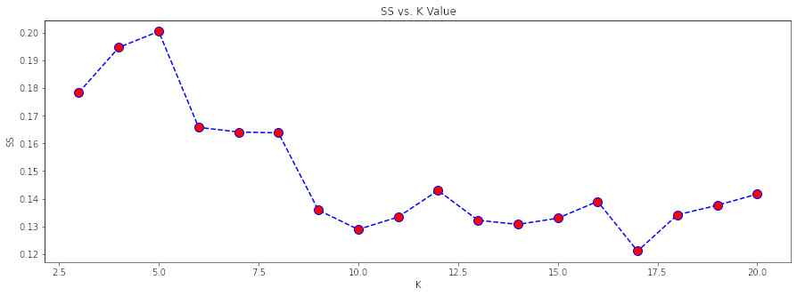
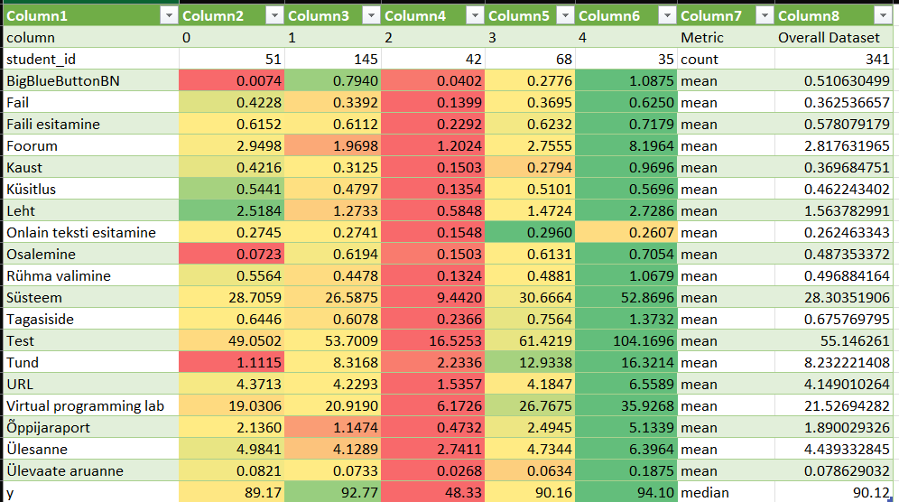

## KMeans Clustering

K-means clustering is an unsupervised machine learning algorithm.

The KMeans algorithm clusters data by trying to separate samples in n groups of equal variance, minimizing a criterion known as the inertia or within-cluster sum-of-squares. 

Files in this folder:

- `data.csv`: Generated data files that have been desensitized.
- `data.ipynb`: Get the data.
- `clustering.ipynb`: Cluster data using KMeans.
- `kmeans_profiling.csv`: Generated profiling data.

### Decide the cluster number

- `inertia`: Sum of squared distances of samples to their closest cluster center.
- `silhouette score`: The silhouette value is a measure of how similar an object is to its own cluster (cohesion) compared to other clusters (separation). 

Inertia:

Silhouette score:

We choose a cluster number of `5` based on the above results to perform cluster analysis.

### Results 

Based on the generated `kmeans_profiling.csv` we can obtain the following table:

Students were divided into 5 groups, numbered `0`, `1`, `2`, `3`, and `4`.

For the components in Moodle, the table shows the average number of times students visit the component per week. The closer to green, the more visits to the component, and the closer to red, the fewer visits.

We analyze each group by `y` value, the final score, in descending order.

### 1: Group 2

- Score: The median score is below 50.
- This type of student uses all components of Moodle the least, reflecting that the student's attention is not engaged in the course.

### 2: Group 0 

- Score: median score above 50, but below 90.
- Students in this category used the BigBlueButton, Osalemnie (Participation registration), and Tund (Lesson tool) components less often and used the Küsitlus (Survey) and Leht (Page) components more often.
- This may reflect the willingness of students to participate in learning, but the learning approach adopted could be further improved.

### 3: Group 3 & Group 1

- Score: median score above 90, but not above 93.
- This type of student uses Moodle components more often. We note that although `Group 1` uses some components less than `Group 3`, but the score is higher. The higher scores may be due to `Group 1` focusing more on `BigBlueButton`.
 
### 4: Group 4

- Score: median score of 94 or higher.
- This type of student uses Moodle most frequently, reflecting a strong interest in the course and active participation.

### References

- [Clustering](https://scikit-learn.org/stable/modules/clustering.html)
- [Clustering in Machine Learning](https://towardsdatascience.com/understanding-k-means-clustering-in-machine-learning-6a6e67336aa1)
- [KMeans](https://scikit-learn.org/stable/modules/generated/sklearn.cluster.KMeans.html)
- [sklearn.metrics.silhouette_score](https://scikit-learn.org/stable/modules/generated/sklearn.metrics.silhouette_score.html)
- [Pandas flexible determination of metrics](https://stackoverflow.com/questions/60576785/pandas-flexible-determination-of-metrics)
- [Clustering and profiling customers using k-Means](https://medium.com/analytics-vidhya/clustering-and-profiling-customers-using-k-means-9afa4277427)
- [How to calculate composite metric in python pandas dataframe](https://stackoverflow.com/questions/41814732/how-to-calculate-composite-metric-in-python-pandas-dataframe)
